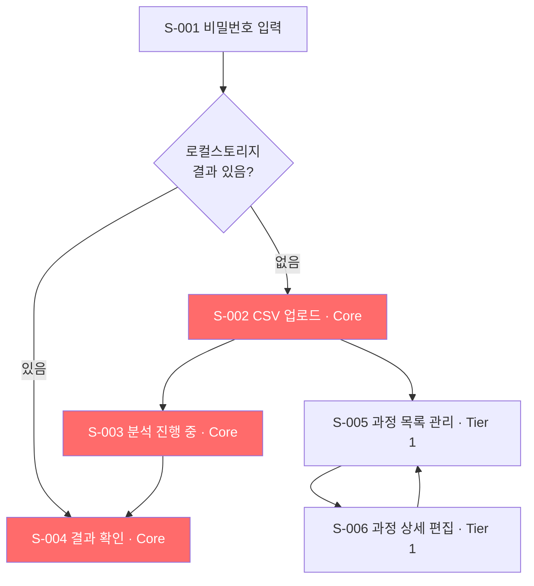
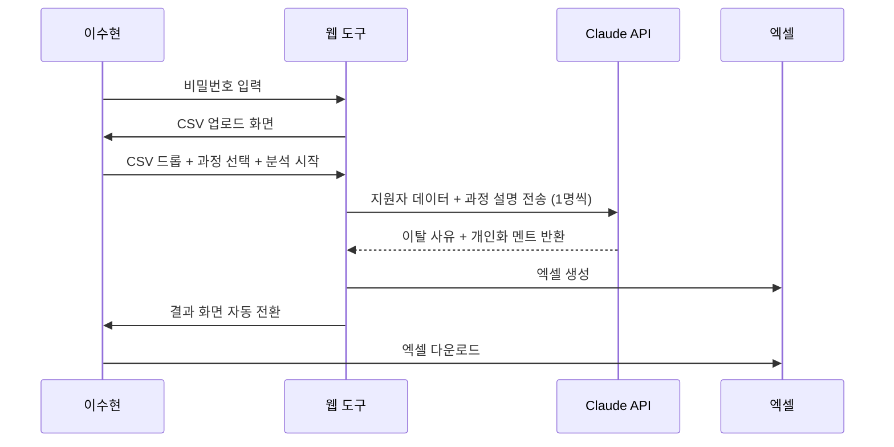
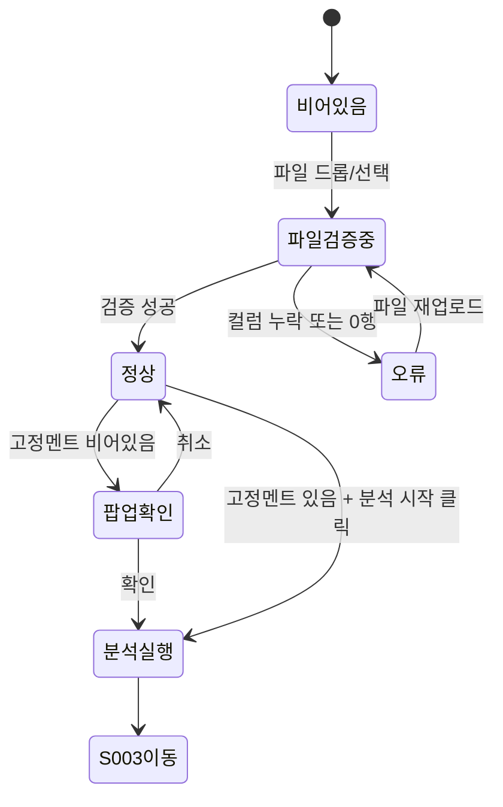
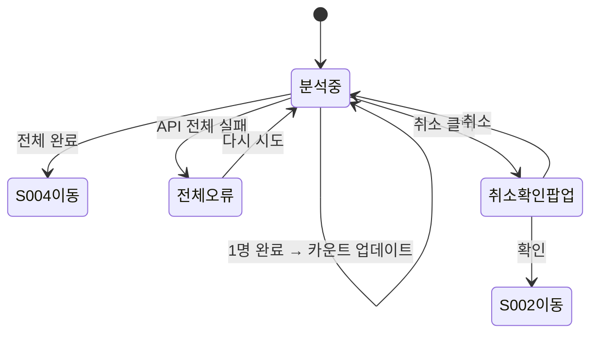
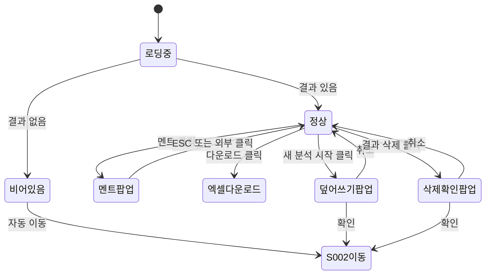
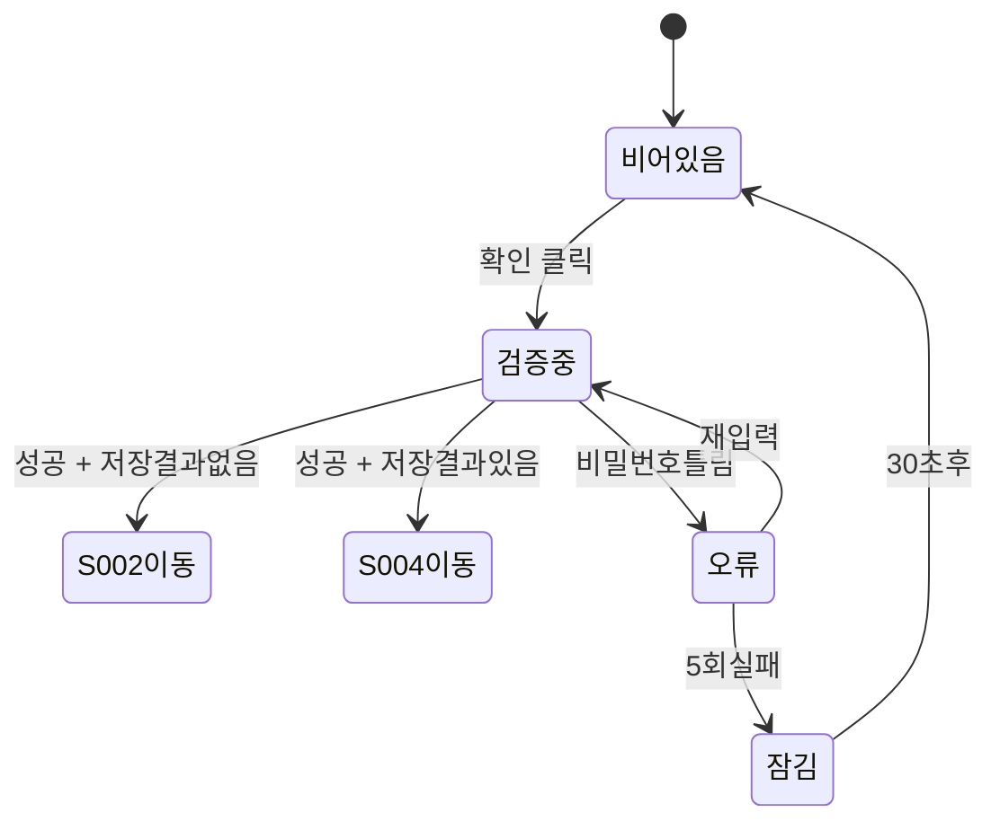
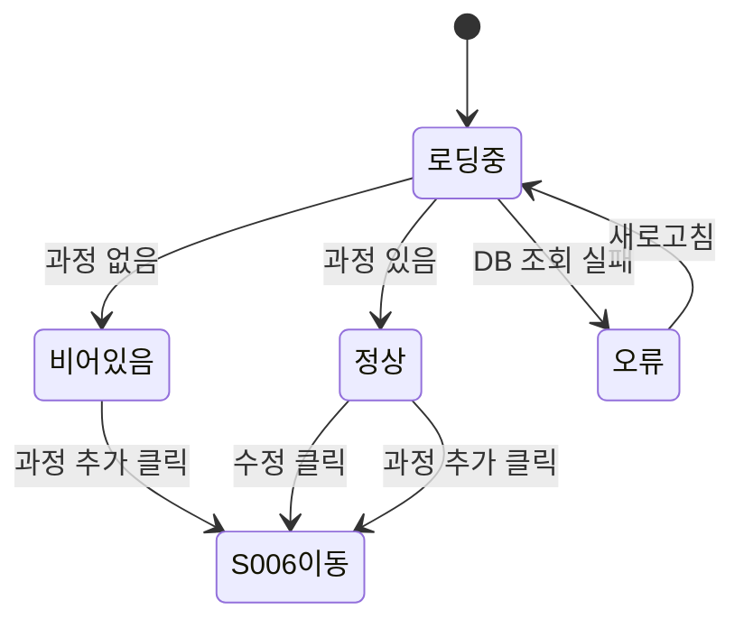
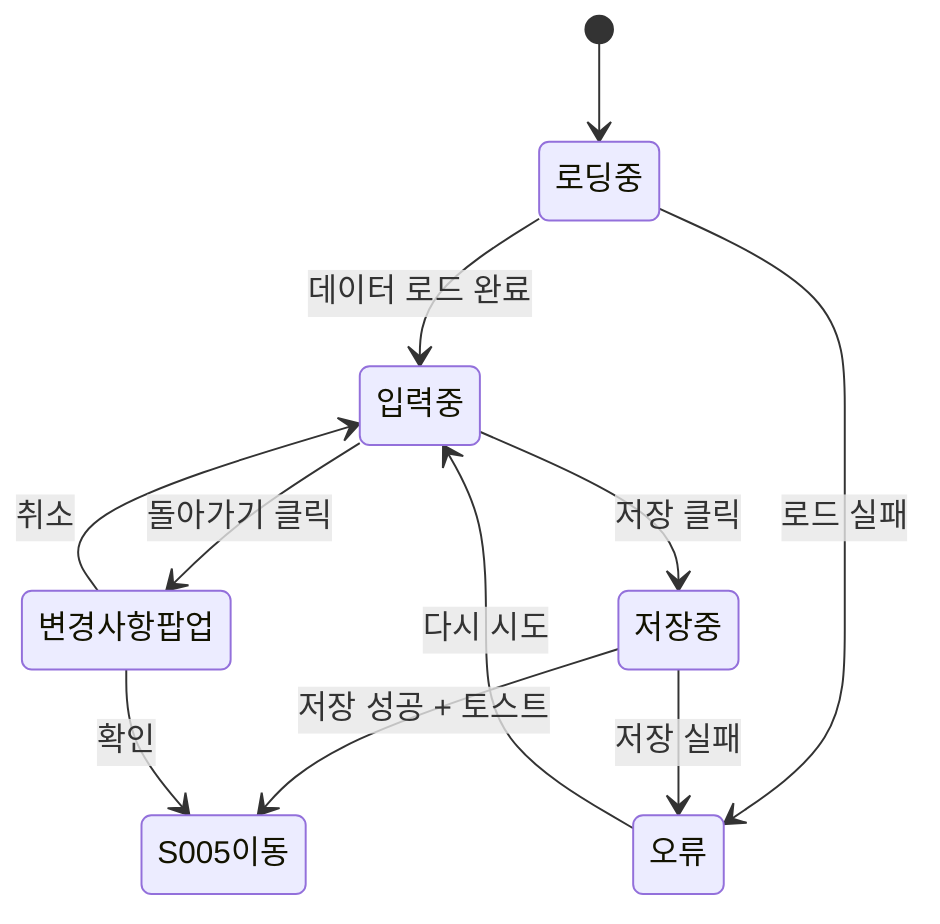
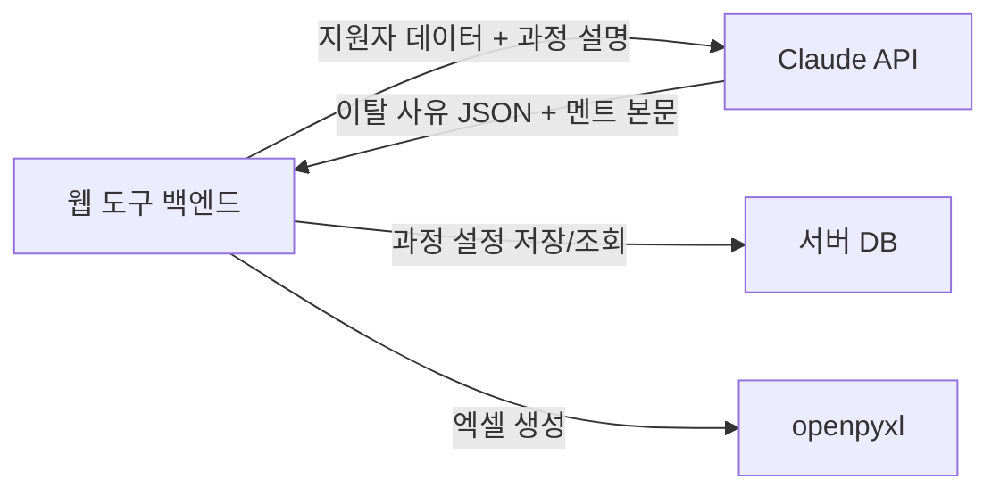

# HRD 전환 어시스턴트 FRD

> 작성일: 2026-06-16 · 버전: v1.0
> PRD: `prd-HRD전환어시스턴트-20260616.md` v1.0
> 다음 단계: TRD (`frd-HRD전환어시스턴트-20260616-handoff.md` 참조)

---

## 1. 한 문단 요약

이 FRD는 총 6개 화면을 다룬다. 그중 핵심은 CSV 업로드·AI 분석·결과 다운로드로 이어지는 세 화면이며, 이 흐름이 작동하는 순간 담당자는 즉시 가치를 얻는다. v1 출시 범위는 Core 3개 + Tier 1 3개 = 6개 화면 전부이며, 추정 개발 기간은 개발자 1인 기준 3~4주다.

TRD에서 결정해야 할 큰 항목은 서버 프레임워크 선택과 Claude API 호출 방식(동기 vs 스트리밍)이다. 미해결 항목은 2건으로 과정명·CSV 컬럼명 불일치 처리 방식과 멘트 미리보기 예시 AI 본문 생성 방식이 남아있다.

---

## 2. 무엇을 만드는가 (화면 지도)

이 도구의 화면은 두 영역으로 나뉜다. 매일 오전 반복하는 핵심 흐름(CSV 업로드 → 분석 → 결과 다운로드)과, 가끔 들어오는 설정 영역(과정·멘트 관리)이다. 두 영역은 상단 네비게이션으로 연결되며, 접속하면 항상 핵심 흐름의 첫 화면인 CSV 업로드 화면부터 시작된다.

### 2.1 전체 화면 흐름



### 2.2 화면 분류 (Tier)

이 도구는 규모가 작아 Tier 2·3 화면이 없다. v1에 Core와 Tier 1 전부를 포함한다. Core는 없으면 서비스가 성립하지 않는 화면이고, Tier 1은 Core를 작동시키기 위한 필수 보조 화면이다.

| Tier | 의미 | 화면 수 | v1 포함 |
|---|---|---|---|
| Core | 빠지면 서비스가 성립하지 않음 | 3개 | ✅ |
| Tier 1 | 필수 보조 | 3개 | ✅ |
| Tier 2 | v1.x 이후 | 0개 | — |
| Tier 3 | v2 이후 | 0개 | — |

> 정밀한 화면 ID 카탈로그(S-001~S-006)와 URL은 핸드오프 §1 참조.

---

## 3. MVP 범위 (핵심 1~2개)

이 도구의 본질은 하나의 흐름으로 표현된다. "CSV 올리고 → 과정 선택하고 → 60초 후 엑셀 받는다." 이 흐름이 막히면 담당자가 이 도구를 쓸 이유가 없고, 이 흐름만 작동해도 매일 오전 파일 준비 시간이 절반으로 줄어든다.

### 3.1 핵심 화면 (Core)

#### Core-1: CSV 업로드 (S-002)

S-002는 담당자가 매일 오전 가장 먼저 만나는 화면이다. 노션에서 내보낸 CSV 하나를 올리고 과정을 선택하는 것이 전부다. 이 화면이 없으면 분석 자체가 시작되지 않는다. 1초 데모 시나리오는 "파일 드롭 → 과정 선택 → 분석 시작 클릭"이며, 세 동작이 10초 안에 끝난다.

#### Core-2: AI 분석 + 결과 출력 (S-003 + S-004)

S-003은 Claude AI가 지원자별 이탈 사유를 분석하는 동안 담당자가 기다리는 화면이다. S-004는 그 결과를 확인하고 엑셀로 받는 최종 목적지다. 이 두 화면이 없으면 도구의 핵심 가치인 "개인화 멘트가 담긴 엑셀"이 전달되지 않는다. 담당자가 하루에 이 화면을 거치는 것은 딱 한 번이지만, 그 한 번이 이 도구 전체의 이유다.

### 3.2 v1 출시 범위 (합산)

Core 3개와 Tier 1 3개를 합쳐 6개 화면 전부를 v1에 출시한다. Tier 1인 과정 관리 화면 없이는 드롭다운이 비어 Core 자체가 작동하지 않으므로 함께 출시해야 한다.

| 항목 | 값 |
|---|---|
| Core 화면 | 3개 (S-002·S-003·S-004) |
| Tier 1 화면 | 3개 (S-001·S-005·S-006) |
| v1 출시 총 화면 | 6개 |
| 추정 개발 기간 (1인) | 3~4주 |
| 추정 개발 기간 (2인) | 1.5~2주 |

---

## 4. 사용자가 화면을 어떻게 거치는가

담당자 이수현이 이 도구를 실제로 쓰는 세 가지 상황을 시나리오로 본다.

### 4.1 시나리오 1: 매일 오전 정상 흐름

이수현은 오전 9시, 노션에서 합격 안내 후 2일차 미등록자를 확인하고 CSV를 내보낸다. 도구에 접속해 비밀번호를 입력하면 CSV 업로드 화면이 바로 열린다. 파일을 드래그 앤 드롭하고 AIO1 과정을 선택한 뒤 분석 시작을 누른다. 로딩 화면에서 "3명 중 2번째 분석 중"을 보며 기다리면 30~60초 후 결과 화면으로 자동 전환된다. 결과 테이블을 훑어보고 엑셀 다운로드 버튼을 누르면 `HRD_독려문자_AIO1_20260616.xlsx`가 즉시 받아진다. 파일을 문자 발송 담당자에게 전달하면 하루 작업이 끝난다.



### 4.2 시나리오 2: 고정 멘트 비어있는 채로 분석 시작

이수현이 새 과정(MLO1)을 방금 등록했는데 앞·뒤 고정 멘트를 아직 입력하지 않았다. CSV를 업로드하고 MLO1을 선택해 분석 시작을 누르면 "MLO1 과정의 앞/뒤 고정 멘트가 비어있습니다. 그대로 진행하시겠습니까?" 팝업이 뜬다. 확인을 누르면 AI 본문만으로 멘트가 생성되어 엑셀에 담긴다. 이수현은 나중에 관리 화면에서 고정 멘트를 추가하면 다음 분석부터 반영된다.

### 4.3 시나리오 3: 브라우저 닫고 재접속

이수현이 결과 화면에서 엑셀을 받기 전에 실수로 브라우저 탭을 닫았다. 다시 도구에 접속해 비밀번호를 입력하면 로컬스토리지에 저장된 마지막 결과가 자동으로 복원되어 결과 화면이 바로 열린다. "2026.06.16 09:23 · AIO1" 분석 일시가 표시되고, 엑셀 다운로드 버튼이 그대로 활성화되어 있다.

---

## 5. 화면별 명세

이 챕터는 각 화면을 "무엇인가 → 어떻게 보이나 → 어떻게 동작하나" 순서로 설명한다. 요소 ID·검증 규칙 상세는 핸드오프 §3·§4 참조.

### 5.1 CSV 업로드 (Core)

#### 이 화면은 무엇인가

S-002는 담당자가 비밀번호 입력 후 가장 먼저 만나는 화면이다. 로컬스토리지에 이전 결과가 없을 때 자동으로 이 화면이 열린다. CSV를 올리고 과정을 선택하면 분석이 시작된다. 이 화면이 이 도구의 현관문이다.

설계에서 가장 주의할 점은 두 가지다. 첫째, 잘못된 파일을 올렸을 때 어떤 컬럼이 빠졌는지 바로 알 수 있어야 한다. 둘째, 과정이 하나도 등록되지 않은 첫 사용 시 당황하지 않도록 안내가 명확해야 한다.

#### 어떻게 보이는가 (구성)

화면 상단에 로고와 "과정·멘트 관리" 링크가 있는 네비게이션이 놓인다. 가운데는 CSV 업로드 영역(드래그 앤 드롭 또는 파일 선택 버튼)과 과정 선택 드롭다운이 세로로 배치된다. 하단에는 "분석 시작" 버튼이 고정된다.

| 사용자가 보는 것 | 비고 |
|---|---|
| 상단 네비게이션 | 로고 + 과정·멘트 관리 링크 |
| CSV 업로드 영역 | 드래그 앤 드롭 + 파일 선택 버튼 |
| 필수 컬럼 안내 | 접기/펼치기 토글 |
| 과정 선택 드롭다운 | 관리 화면에 등록된 과정 목록 |
| 분석 시작 버튼 | 파일 + 과정 모두 선택 시 활성화 |

> 정밀한 요소 ID·타입·라벨·클릭 동작은 핸드오프 §3 참조.

#### 어떻게 동작하는가 (5개 상태)

이 화면은 파일 업로드 여부와 과정 선택 여부에 따라 다섯 가지 모습으로 바뀐다.

**정상 (Success)**
CSV 파일이 업로드되고 과정도 선택된 상태다. 업로드 영역에 파일명과 행 수가 표시되고 "분석 시작" 버튼이 활성화된다. 분석 시작 클릭 시 선택 과정의 고정 멘트가 비어있으면 "그대로 진행하시겠습니까?" 팝업이 먼저 뜬다.

**비어있을 때 (Empty)**
접속 직후 아무것도 선택되지 않은 상태다. 업로드 영역은 점선 테두리의 드롭존으로 표시된다. 과정 드롭다운에 등록된 과정이 없으면 "먼저 과정을 등록해주세요" 안내와 관리 화면 링크가 드롭다운 아래에 표시된다.

**불러오는 중 (Loading)**
파일을 드롭하거나 선택한 직후 CSV를 읽고 컬럼을 검증하는 동안 업로드 영역에 스피너가 표시된다. 통상 1~2초 내 완료된다.

**문제가 생겼을 때 (Error)**
CSV 형식 오류 시 업로드 영역 아래에 구체적인 에러 메시지가 표시된다. "이름 컬럼이 없습니다", "지원동기 컬럼이 없습니다"처럼 빠진 컬럼명을 명시한다. CSV에 데이터 행이 0건이면 "분석할 지원자가 없습니다" 메시지가 표시된다. 파일을 다시 올리면 에러가 초기화된다.

**잠겼을 때 (Disabled)**
파일만 올리고 과정을 선택하지 않았거나, 과정만 선택하고 파일이 없는 경우 "분석 시작" 버튼이 비활성화된다.



#### 인터랙션 핵심

담당자가 이 화면에서 하는 행동은 파일 올리기, 과정 선택하기, 분석 시작하기 세 가지다. 이 흐름이 자연스럽게 이어지도록 설계한다.

| 사용자 행동 | 시스템 반응 |
|---|---|
| CSV 드롭 또는 파일 선택 | 즉시 컬럼 검증 + 성공 시 파일명·행 수 표시 |
| 과정 드롭다운 선택 | 선택 과정명 표시, 버튼 활성화 조건 충족 여부 확인 |
| 분석 시작 클릭 | 고정멘트 빈 경우 팝업 → 확인 시 S-003 이동 |
| 잘못된 파일 형식 업로드 | 에러 메시지 즉시 표시, 재업로드 유도 |
| 같은 날 재분석 시도 | "이전 결과를 덮어씁니다. 먼저 다운로드하셨습니까?" 팝업 |

> 검증 규칙 상세(필수 컬럼 목록, 서버 검증 흐름)와 인수 기준은 핸드오프 §4·§5 참조.

---

### 5.2 분석 진행 중 (Core)

#### 이 화면은 무엇인가

S-003은 담당자가 "분석 시작"을 누른 후 Claude API가 분석을 완료할 때까지 기다리는 화면이다. 담당자가 할 수 있는 행동이 없지만, 설계가 나쁘면 불안해서 새로고침을 눌러 분석이 처음부터 다시 시작되는 문제가 생긴다. 이 화면의 목적은 "잘 진행되고 있다"는 안심이다.

#### 어떻게 보이는가 (구성)

화면 중앙에 로딩 스피너와 진행 현황이 표시된다. 취소 링크는 하단에 작게 배치한다.

| 사용자가 보는 것 | 비고 |
|---|---|
| 로딩 스피너 | 화면 중앙 |
| 진행 현황 텍스트 | "5명 중 3번째 분석 중..." |
| 예상 완료 시간 | "약 N초 후 완료" |
| 분석 취소 링크 | 하단, 작은 텍스트 |

#### 어떻게 동작하는가 (5개 상태)

이 화면은 분석 진행 중이라는 단일 상태가 기본이지만, 전체 실패와 취소 분기가 있다.

**정상 (Success)**
모든 지원자 분석이 완료되면 자동으로 S-004로 전환된다. 담당자가 버튼을 누를 필요 없다.

**비어있을 때 (Empty)**
해당 없음. 이 화면은 항상 분석 진행 중 상태다.

**불러오는 중 (Loading)**
이 화면 전체가 로딩 상태다. 지원자 1명 완료 시마다 진행 카운트가 업데이트된다.

**문제가 생겼을 때 (Error)**
Claude API 전체 호출 실패 시 화면 중앙에 에러 메시지와 "다시 시도" 버튼이 표시된다. 일부 지원자만 실패한 경우는 에러로 처리하지 않고 S-004에서 "분석 실패" 행으로 표시한다.

**잠겼을 때 (Disabled)**
분석 중에는 취소 링크 외 모든 인터랙션이 잠긴다.



#### 인터랙션 핵심

담당자가 할 수 있는 행동은 기다리거나 취소하는 것뿐이다.

| 사용자 행동 | 시스템 반응 |
|---|---|
| 아무것도 안 함 (대기) | 분석 완료 시 자동으로 S-004 이동 |
| 취소 링크 클릭 | "취소하면 처음부터 다시 해야 합니다" 확인 팝업 → 확인 시 S-002 이동 |
| 새로고침 | 브라우저 기본 동작으로 S-002 이동 |

---

### 5.3 결과 확인 + 엑셀 다운로드 (Core)

#### 이 화면은 무엇인가

S-004는 담당자가 매일 이 도구를 쓰는 최종 목적지다. AI 분석 결과를 한눈에 확인하고 엑셀 파일을 받아 문자 발송 담당자에게 전달한다. 브라우저를 실수로 닫아도 로컬스토리지에 결과가 보관되어 재접속 시 이 화면부터 시작된다.

이 화면의 핵심은 "다운로드 전 결과를 빠르게 훑어볼 수 있는가"다. 분석 실패 행이 있으면 즉시 눈에 띄어야 하고, 멘트 전문은 클릭 시 팝업으로 확인할 수 있어야 한다.

#### 어떻게 보이는가 (구성)

상단에 분석 일시·과정명과 엑셀 다운로드 버튼이 고정된다. 가운데에 결과 테이블이 놓이며, 하단에 새 분석 시작 버튼과 결과 삭제 링크가 배치된다.

| 사용자가 보는 것 | 비고 |
|---|---|
| 분석 일시 + 과정명 | "2026.06.16 09:23 · AIO1" |
| 엑셀 다운로드 버튼 | 상단 우측 고정 |
| 결과 테이블 | 이름·이탈사유·멘트 첫 30자 |
| 멘트 전문 팝업 | 멘트 클릭 시 열림, ESC 또는 외부 클릭으로 닫기 |
| 분석 실패 행 | 빨간 배경으로 구분 |
| 새 분석 시작 버튼 | S-002로 이동 |
| 결과 삭제 링크 | 하단, 작은 텍스트 |

#### 어떻게 동작하는가 (5개 상태)

**정상 (Success)**
모든 지원자 분석이 성공한 상태다. 결과 테이블에 전원의 이탈 사유와 멘트 첫 30자가 표시되고 엑셀 다운로드 버튼이 활성화된다.

**비어있을 때 (Empty)**
로컬스토리지에 저장된 결과가 없을 때다. "아직 분석 결과가 없습니다" 안내와 함께 자동으로 S-002로 이동한다.

**불러오는 중 (Loading)**
브라우저 재접속 후 로컬스토리지에서 결과를 불러오는 순간이다. 1초 미만으로 짧다.

**문제가 생겼을 때 (Error — 일부 실패)**
분석 실패 지원자 행이 빨간 배경으로 표시된다. "N명 분석 실패 — 해당 지원자는 수동으로 확인해주세요" 안내가 테이블 상단에 표시된다. 엑셀에도 실패 행이 포함되되 멘트 칸이 비어있다.

**잠겼을 때 (Disabled)**
해당 없음.



#### 인터랙션 핵심

| 사용자 행동 | 시스템 반응 |
|---|---|
| 엑셀 다운로드 클릭 | `HRD_독려문자_AIO1_20260616.xlsx` 즉시 다운로드 |
| 멘트 첫 30자 클릭 | 멘트 전문 팝업 열림 |
| 팝업 외부 클릭 또는 ESC | 팝업 닫힘 |
| 새 분석 시작 클릭 | "이전 결과를 덮어씁니다" 확인 팝업 → 확인 시 S-002 이동 |
| 결과 삭제 클릭 | "삭제하면 복구할 수 없습니다" 확인 팝업 → 확인 시 로컬스토리지 초기화 + S-002 이동 |
| 재접속 | 로컬스토리지 결과 자동 복원 + 분석 일시 표시 |

---

### 5.4 비밀번호 입력 (Tier 1)

#### 이 화면은 무엇인가

S-001은 도구에 처음 접속할 때 한 번만 거치는 화면이다. 세션이 8시간 유지되므로 하루 한 번 아침에 입력하면 그날은 다시 볼 일이 없다. 비밀번호는 서버 환경변수로만 관리하며 화면에서 변경할 수 없다.

#### 어떻게 보이는가 (구성)

화면 중앙에 로고, 비밀번호 입력 필드, 확인 버튼만 있는 최소한의 구성이다.

| 사용자가 보는 것 | 비고 |
|---|---|
| 로고 | 상단 중앙 |
| 비밀번호 입력 필드 | 마스킹 처리 |
| 확인 버튼 | 입력 시 활성화 |

#### 어떻게 동작하는가 (5개 상태)

이 화면은 단순하지만 틀렸을 때 안내와 5회 잠금 처리가 명확해야 한다.

**정상 (Success)**
비밀번호가 맞으면 로컬스토리지를 확인한다. 저장된 결과가 있으면 S-004로, 없으면 S-002로 이동한다.

**비어있을 때 (Empty)**
접속 직후 입력 필드가 비어있고 확인 버튼이 비활성화된다.

**불러오는 중 (Loading)**
확인 버튼 클릭 후 서버 검증 동안 버튼에 스피너가 표시된다.

**문제가 생겼을 때 (Error)**
비밀번호가 틀리면 입력 필드 아래 "비밀번호가 맞지 않습니다" 메시지와 빨간 테두리가 표시된다.

**잠겼을 때 (Disabled)**
5회 연속 실패 시 30초간 입력이 잠기고 "잠시 후 다시 시도해주세요" 안내가 표시된다.



#### 인터랙션 핵심

| 사용자 행동 | 시스템 반응 |
|---|---|
| 비밀번호 입력 후 확인 클릭 | 서버 검증 → 성공 시 S-002 또는 S-004 이동 |
| 엔터 키 입력 | 확인 버튼과 동일하게 동작 |
| 5회 연속 실패 | 30초 잠금 |

---

### 5.5 과정 목록 관리 (Tier 1)

#### 이 화면은 무엇인가

S-005는 담당자가 과정별 설명과 앞·뒤 고정 멘트를 관리하는 설정 화면이다. 새 기수가 시작되거나 어필 포인트가 바뀔 때만 들어온다. 처음 도구를 설치한 직후에는 과정이 하나도 없어 S-002 드롭다운이 비어있으므로, 첫 사용 시 이 화면부터 시작하도록 안내가 명확해야 한다.

#### 어떻게 보이는가 (구성)

상단에 "과정 추가" 버튼이 고정되고, 아래에 등록된 과정 카드 목록이 표시된다. 각 카드에는 과정명, 과정 설명 첫 줄, 수정 버튼이 있다.

| 사용자가 보는 것 | 비고 |
|---|---|
| 과정 추가 버튼 | 상단 우측 |
| 과정 카드 목록 | 과정명 + 설명 첫 줄 + 수정 버튼 |
| 빈 상태 안내 | 과정 없을 때 중앙 표시 |

#### 어떻게 동작하는가 (5개 상태)

**정상 (Success)**
등록된 과정 카드가 목록으로 표시된다. 각 카드의 수정 버튼을 클릭하면 S-006으로 이동한다.

**비어있을 때 (Empty)**
"아직 등록된 과정이 없습니다. 과정을 먼저 등록해주세요" 안내와 함께 "과정 추가" 버튼이 화면 중앙에 크게 표시된다.

**불러오는 중 (Loading)**
과정 목록을 DB에서 불러오는 동안 카드 형태의 스켈레톤 UI가 표시된다.

**문제가 생겼을 때 (Error)**
DB 조회 실패 시 "과정 목록을 불러오지 못했습니다. 새로고침해주세요" 안내가 표시된다.

**잠겼을 때 (Disabled)**
해당 없음.



#### 인터랙션 핵심

| 사용자 행동 | 시스템 반응 |
|---|---|
| 과정 추가 클릭 | S-006 빈 폼으로 이동 |
| 수정 클릭 | S-006 해당 과정 데이터 채워진 폼으로 이동 |

---

### 5.6 과정 상세 편집 (Tier 1)

#### 이 화면은 무엇인가

S-006은 개별 과정의 앞 고정 멘트, 과정 설명, 뒤 고정 멘트를 입력·수정하는 화면이다. 새 과정 추가와 기존 과정 수정이 같은 화면에서 이루어진다. 과정 설명은 Claude가 지원자별 맞춤 멘트를 만들 때 참조하는 핵심 재료다. 잘 쓸수록 AI 멘트 품질이 높아지므로, 200자 이내 글자 수 카운터와 작성 팁을 함께 표시한다.

#### 어떻게 보이는가 (구성)

상단에 "과정 목록으로 돌아가기" 링크가 있고, 아래에 4개 입력 필드가 세로로 배치된다.

| 사용자가 보는 것 | 비고 |
|---|---|
| 돌아가기 링크 | 상단 좌측 |
| 과정명 입력 필드 | 신규 시 빈 칸, 수정 시 기존값 |
| 앞 고정 멘트 텍스트 영역 | 선택 입력 |
| 과정 설명 텍스트 영역 | 글자 수 카운터 + 작성 팁 |
| 뒤 고정 멘트 텍스트 영역 | 선택 입력 |
| 저장 버튼 | 하단 고정, 과정명 있을 때 활성화 |
| 멘트 미리보기 버튼 | 저장 전 조합 확인 |

#### 어떻게 동작하는가 (5개 상태)

**정상 (Success)**
저장 완료 시 "저장됐습니다" 토스트 메시지가 표시되고 S-005로 돌아간다.

**비어있을 때 (Empty)**
신규 추가 시 과정명 외 모든 필드가 빈 칸이다. 저장 버튼은 과정명 입력 시에만 활성화된다.

**불러오는 중 (Loading)**
수정 모드 진입 시 기존 데이터를 불러오는 동안 필드에 스켈레톤 UI가 표시된다.

**문제가 생겼을 때 (Error)**
저장 실패 시 "저장에 실패했습니다. 다시 시도해주세요" 메시지가 표시된다. 입력 내용은 유지된다.

**잠겼을 때 (Disabled)**
과정명이 비어있으면 저장 버튼이 비활성화된다.



#### 인터랙션 핵심

| 사용자 행동 | 시스템 반응 |
|---|---|
| 과정 설명 입력 | 실시간 글자 수 카운터 업데이트 (200자 초과 시 빨간색) |
| 멘트 미리보기 클릭 | 앞 고정 + 예시 AI 본문 + 뒤 고정 조합 팝업 |
| 저장 클릭 | DB 저장 → 성공 시 토스트 + S-005 이동 |
| 돌아가기 클릭 | 변경사항 있으면 "저장하지 않고 나가시겠습니까?" 팝업 |
| 과정명 중복 입력 후 저장 | 과정명 필드 아래 "이미 있는 과정명입니다" 에러 표시 |

---

## 6. 공통 컴포넌트와 권한

이 도구에는 여러 화면에 반복 등장하는 공통 요소가 있으며, 사용자는 비로그인과 로그인 두 상태만 존재한다.

### 6.1 공통 컴포넌트

로그인 후 모든 화면 상단에 동일한 네비게이션이 표시된다. 로고를 클릭하면 S-002로 이동하고, "과정·멘트 관리" 링크를 클릭하면 S-005로 이동한다. 확인 팝업(모달)은 도구 전체에서 동일한 스타일로 표시된다.

| 공통 요소 | 표시 화면 | 동작 |
|---|---|---|
| 상단 네비게이션 | S-002·S-003·S-004·S-005·S-006 | 로고 → S-002, 관리 → S-005 |
| 확인 팝업 (모달) | 전체 | 확인/취소 두 버튼, ESC로 취소 |
| 토스트 메시지 | S-006 | 저장 성공 시 2초 표시 후 자동 사라짐 |

### 6.2 권한 차이 요약

이 도구는 비로그인과 로그인 두 상태만 있다. 비로그인 사용자는 S-001 비밀번호 화면만 접근할 수 있고, 나머지 모든 화면은 로그인 상태에서만 접근 가능하다.

| 화면 | 비로그인 | 로그인 |
|---|---|---|
| S-001 비밀번호 입력 | ✅ | 자동으로 S-002 이동 |
| S-002 ~ S-006 | ❌ S-001로 리다이렉트 | ✅ |

> 정밀한 화면별 권한 매트릭스는 핸드오프 §2 참조.

---

## 7. 외부에 무엇이 필요한가

이 도구는 외부 의존성이 Claude API 하나뿐이다. 이 API가 없으면 도구의 핵심 기능 전체가 작동하지 않는다.

| 의존 대상 | 용도 | 누락 시 영향 |
|---|---|---|
| Claude API (claude-haiku-4-5) | 이탈 사유 분석 + 개인화 멘트 생성 | 핵심 기능 전체 불가 |



> API 엔드포인트·인증 방식·요청 형식·프롬프트 전문은 PRD 핸드오프 §4 참조. TRD에서 더 깊게 다룬다.

---

## 8. 비개발자가 빠뜨리기 쉬운 것 점검

FRD 작성 중 자동으로 5종 Blindspot Check를 수행했다. 전체 이상 없음이지만 주의 항목 2건이 운영 주의사항으로 남았다.

| 점검 항목 | 결과 |
|---|---|
| 5개 상태 정의 (Empty/Loading/Error/Success/Disabled) | ✅ 6개 화면 모두 정의 |
| 예외 흐름 (세션 만료·API 실패·0행 CSV 등) | ✅ 핵심 화면 정의됨 |
| 권한 매트릭스 | ✅ §6.2 참조 |
| 검증 규칙 (필수 컬럼·중복 체크) | ✅ 핸드오프 §4 |
| 엣지 케이스 (과정명 불일치·멘트 미리보기 AI 본문) | ⚠️ 2건 운영 주의사항 처리 |

상세 발견 사항과 대응은 부록 A 참조.

---

## 9. 미해결 / 향후 단계

FRD 단계에서 결정을 미룬 항목과 v2 이후 항목이다.

- **과정명·CSV 과정 불일치 감지 불가**: 담당자가 드롭다운에서 잘못된 과정을 선택해도 도구가 알 수 없다. 운영 주의사항으로 명시하고 v2에서 CSV 과정명 컬럼 추가로 해결.
- **멘트 미리보기 예시 AI 본문**: S-006에서 저장 전 미리보기 팝업에 들어갈 예시 AI 본문 생성 방식 미정. TRD에서 "저장된 과정 설명으로 예시 멘트를 실제 API 호출로 생성할지, 고정 예시 텍스트를 사용할지" 결정 필요.
- **v2 이후 — 노션 API 자동 연동**: 수동 CSV 내보내기를 없애고 노션에서 직접 데이터를 가져오는 방식. 데이터 누적 후 검토.
- **v2 이후 — 전환율 추적 대시보드**: 아웃콜 후 실제 HRD 등록 여부를 기록하고 멘트별 전환율 비교.
- **v2 이후 — 계정별 로그인**: 사용자 2명 이상 필요 시 추가.

---

## 부록 A. 적대적 검토 결과

```
━━━ 🔍 적대적 검토 ━━━
검토 관점: Dev + QA 관점
검토 대상: HRD 전환 어시스턴트 FRD v1.0

🔴 HIGH-1: 고정 멘트 팝업 트리거 시점 — 해결됨
   수정안 반영: S-002 분석 시작 클릭 시 팝업
   (저장 시점이 아닌 분석 시점)

🟡 MEDIUM-1: 멘트 팝업 닫기 방법 — 해결됨
   수정안 반영: ESC 키 또는 팝업 외부 클릭으로 닫기

🟡 MEDIUM-2: 로컬스토리지 복원 후 화면 분기 — 해결됨
   수정안 반영: 로그인 성공 후 클라이언트에서
   로컬스토리지 확인 → S-004 또는 S-002 분기

🟢 LOW-1: 과정명 중복 에러 메시지 위치 — 해결됨
   수정안 반영: 과정명 입력 필드 바로 아래 표시

━━━ 요약 ━━━
🔴 HIGH: 0건 / 🟡 MEDIUM: 0건 / 🟢 LOW: 0건
진행 판정: 전체 해결 — TRD 진행 가능
━━━━━━━━━━━━━━━━━
```
