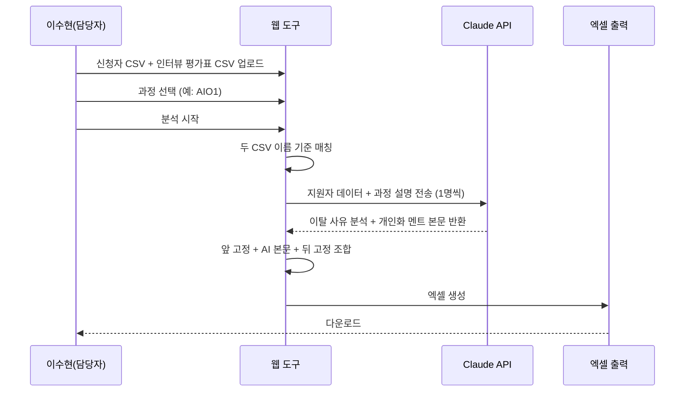
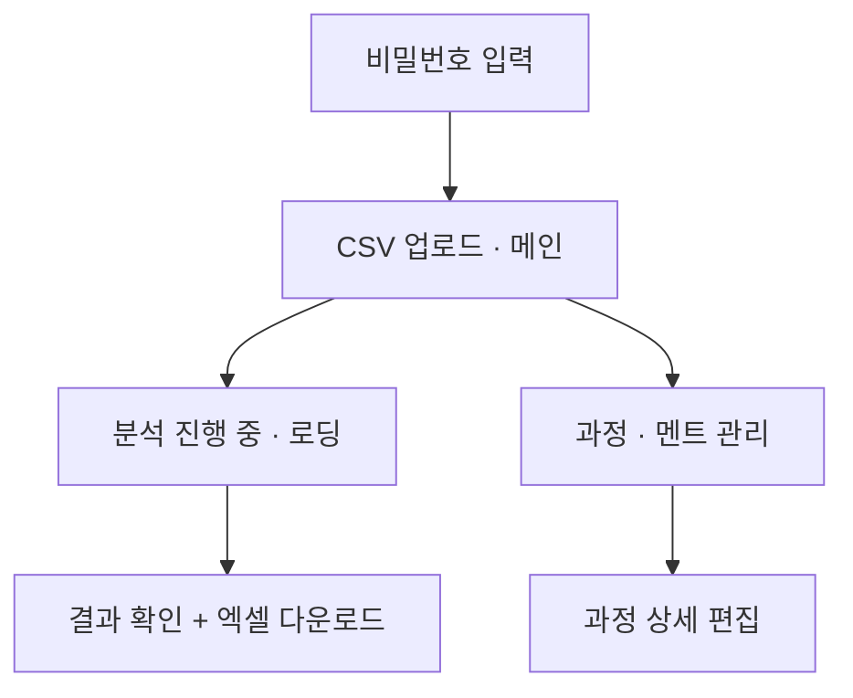
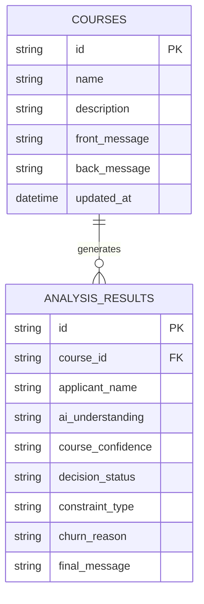
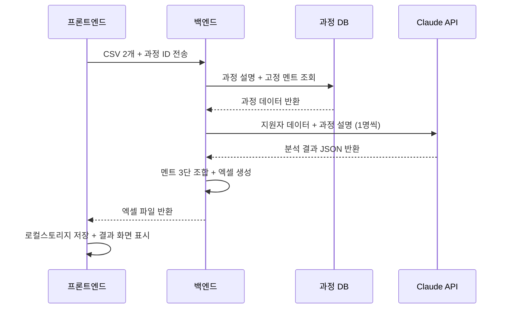

# HRD 전환 어시스턴트 PRD

> 작성일: 2026-06-16 · 버전: v1.0
> 다음 단계: FRD (`prd-HRD전환어시스턴트-20260616-handoff.md` 참조)

---

## 1. 한 문단 요약

HRD 전환 어시스턴트는 직업훈련 기관의 운영 담당자가 매일 오전, 합격 안내 후 2일차 HRD 미등록자에게 보낼 개인화 독려 문자 멘트를 자동으로 생성해주는 내부 웹 도구다. 담당자는 노션에서 내보낸 신청자 CSV와 인터뷰 평가표 CSV 두 파일을 업로드하고 과정을 선택하면, Claude AI가 지원자별 이탈 사유를 분석하고 과정 설명을 참조해 개인화 멘트를 생성한다. 결과는 엑셀 파일로 즉시 다운로드되어 문자 발송 담당자에게 전달된다.

개발 기간은 3~4주, 개발자 1명, Claude API 비용은 월 200원 미만으로 예상된다. 주요 리스크는 두 CSV 파일 간 이름 매칭 오류와 인터뷰 평가표 컬럼 형식 불일치이며, 초기 운영 1~2회로 빠르게 검증 가능하다.

---

## 2. 왜 만드는가

### 2.1 현재 어떻게 일하고 있나

운영 담당자는 매일 오전 노션에서 "최종결과 = 합격안내" 상태인 지원자를 확인하고, 합격 안내 후 2일이 지났음에도 HRD(내일배움카드로 직업훈련을 신청하는 정부 시스템)를 등록하지 않은 대상자를 수작업으로 골라낸다. 이후 문자 발송 담당자에게 기수·이름·번호가 담긴 파일을 전달하고, 담당자는 동일한 리마인드 문자를 일괄 발송한다. 대상자가 하루 5명 미만이지만 개인화 멘트를 수작업으로 만들기엔 시간이 부족해 일괄 안내로 대체되고 있다.

### 2.2 무엇이 답답한가

지원자마다 이탈 사유가 다르다. 취업 병행을 고민하는 사람, 과정에 확신이 없는 사람, 내일배움카드 발급이 안 된 사람이 섞여 있는데 모두에게 같은 멘트가 나간다. 담당자가 문자 발송 전에 개인별 상황을 파악하려면 노션을 따로 열어봐야 해 시간이 부족하고, 결국 일괄 안내 문자로 대체되고 있다.

### 2.3 우리가 어떻게 바꾸는가

담당자가 CSV 두 개를 업로드하면 Claude AI가 지원자별 이탈 사유를 자동 분석하고, 미리 저장해둔 과정 설명을 참조해 개인화 멘트를 생성한다. 멘트는 앞 고정 멘트 + AI 개인화 본문 + 뒤 고정 멘트 + HRD 등록 링크 4단 구조로 조합되어 엑셀 파일에 담긴다. 문자 발송 담당자는 파일을 열면 바로 개인화 문자를 발송할 수 있는 상태가 된다. 운영 담당자의 파일 준비 시간이 절반 이하로 줄고, 지원자별 맞춤 독려 문자로 HRD 등록 전환율이 높아진다.

---

## 3. 누가 쓰는가

이 도구의 직접 사용자는 합격자 관리와 문자 발송 파일 준비를 담당하는 운영팀 담당자 1명이다. 문자 발송 담당자는 완성된 엑셀 파일을 수령해 개인화 독려 문자를 발송하는 역할이므로 도구를 직접 조작하지 않는다.

### 3.1 핵심 페르소나

| 변수 | 값 |
|---|---|
| 이름 | 이수현 (가상) |
| 직업·역할 | 운영팀 담당자 — 합격자 관리, 아웃콜 파일 준비 |
| 디지털 숙련도 | 중간 — 노션·엑셀 익숙, 코드 실행 불가 |
| 사용 기기 | PC 웹 브라우저 (크롬) |
| 사용 맥락 | 매일 오전, 노션 확인 후 30분 내 파일 준비 완료 목표 |
| 핵심 동기 | 매니저가 바로 쓸 수 있는 개인화 파일을 빠르게 전달 |
| 좌절 경험 | 지원자마다 상황이 다른데 멘트는 똑같아서 전환율이 낮음 |
| 의사결정 기준 | "매니저에게 도움이 되는가" + "오전 안에 끝낼 수 있는가" |

### 3.2 비대상 사용자

문자 발송 담당자(결과물 수령자), 개발자(도구 제작자), 지원자 본인(문자 수신자)은 이 도구를 직접 사용하지 않는다.

---

## 4. 사용자 시나리오

이 도구가 실제로 어떻게 쓰이는지 두 가지 상황으로 보여준다.

### 시나리오 1: 매일 오전 정상 흐름

이수현은 오전 9시, 노션에서 합격 안내 후 2일차 미등록자를 직접 확인하고 해당 인원의 신청자 CSV와 인터뷰 평가표 CSV를 각각 내보낸다. 도구에 접속해 비밀번호를 입력하면 CSV 업로드 화면이 바로 나타난다. 두 파일을 업로드하고 과정(예: AIO1)을 선택한 뒤 분석 시작 버튼을 누른다. 로딩 스피너가 돌고, 30~60초 후 결과 화면으로 자동 전환된다. 이수현은 지원자별 이탈 사유와 멘트를 간단히 확인하고 엑셀 다운로드 버튼을 클릭해 파일을 받는다. 파일명은 `HRD_독려문자_AIO1_20260616.xlsx` 형식으로 자동 생성된다.



### 시나리오 2: 과정 설명 업데이트

새 기수 모집이 시작되거나 과정 어필 포인트가 바뀌면 이수현은 상단 네비게이션에서 관리 화면으로 이동한다. 해당 과정을 선택해 과정 설명(200자 이내)과 앞·뒤 고정 멘트를 수정하고 저장한다. 다음 날 분석부터 바뀐 내용이 자동 반영된다. 새 과정이 생기면 과정 추가 버튼으로 등록하고, 처음 사용 시 과정이 없으면 "먼저 과정을 등록해주세요" 안내와 함께 관리 화면 링크가 표시된다.

---

## 5. 무엇을 만드는가

이 챕터에서는 화면 구조, 핵심 기능, 데이터 모델 개요를 다룬다. 정밀한 기능 ID 카탈로그와 SQL 스키마는 핸드오프 파일을 참조한다.

### 5.1 화면 구조

총 6개 화면으로 구성된다. 접속하면 비밀번호 입력 후 바로 CSV 업로드 메인 화면으로 진입하고, 상단 네비게이션으로 관리 화면에 접근한다.



### 5.2 핵심 기능

#### 5.2.1 접속 보안

단일 비밀번호로 접속하는 단순 인증 구조다. 브라우저를 닫았다 열어도 8시간 동안 로그인이 유지된다. 추후 사용자가 2명 이상으로 늘어나면 계정별 로그인으로 확장 가능한 구조로 설계한다.

#### 5.2.2 CSV 업로드 + 분석 실행

두 개의 CSV 파일(신청자 파일, 인터뷰 평가표 파일)을 각각 업로드하고 과정을 선택한 뒤 분석을 시작한다. 파일 업로드 즉시 필수 컬럼 존재 여부를 검증하고, 형식 오류 시 즉시 에러 메시지를 표시한다. 두 파일은 이름 컬럼을 기준으로 자동 매칭된다. 분석 중에는 로딩 스피너가 표시되고, 완료 시 자동으로 결과 화면으로 전환된다.

#### 5.2.3 AI 분석 + 멘트 조합

Claude API(Haiku)가 지원자 1명씩 순차적으로 이탈 사유를 분석한다. 분석 항목은 AI/직무 이해도, 과정 확신도, 의사결정 상태, 현실 제약 여부 4가지다. 분석 결과와 관리 화면에 저장된 과정 설명을 함께 참조해 개인화 멘트 본문을 생성하고, 앞 고정 + AI 본문 + 뒤 고정으로 자동 조합한다. API 호출 실패 시 해당 행은 "분석 실패"로 표시하고 나머지는 계속 진행한다.

#### 5.2.4 결과 확인 + 엑셀 출력

분석 결과를 테이블로 화면에 표시하고, 엑셀 다운로드 버튼을 제공한다. 파일명은 `HRD_아웃콜_{과정명}_{날짜}.xlsx` 형식으로 자동 생성된다. 결과는 브라우저 로컬스토리지(브라우저가 PC에 임시 저장하는 공간 — 브라우저를 닫아도 유지됨)에 보관되어 실수로 화면을 닫아도 복원된다. 새 CSV 업로드 시 자동 덮어쓰기되며, "결과 삭제" 버튼으로 수동 초기화도 가능하다.

#### 5.2.5 과정·멘트 관리

과정별로 앞 고정 멘트, 과정 설명(200자 이내), 뒤 고정 멘트를 각각 저장·수정할 수 있다. 과정 추가·수정 기능을 제공하며, 과정 삭제는 v2에서 추가한다. 글자 수 카운터와 멘트 미리보기(앞 고정 + 예시 AI 본문 + 뒤 고정 조합)는 선택 기능으로 구현한다.

> 정밀한 기능 ID 카탈로그(F-001~F-028)와 Empty/Loading/Error 상태 정의는 핸드오프 파일 §2 참조.

### 5.3 데이터 모델 (개요)

과정 설정 데이터는 서버 DB에 저장되고, 분석 결과는 서버에 저장하지 않는다. 브라우저 로컬스토리지에 마지막 분석 결과 1회분만 임시 보관한다.



> 전체 SQL 스키마는 핸드오프 파일 §3 참조.

---

## 6. 어떻게 만드는가

기술 스택과 보안 핵심 결정을 다룬다. 상세한 아키텍처 설계는 TRD에서 결정한다.

### 6.1 기술 구조 (요약)

단일 서버에서 프론트엔드와 백엔드를 함께 운영하는 모놀로식(하나의 서버 안에 모든 기능을 담는 구조 — 소규모 내부 도구에 가장 적합) 구조다.

| 영역 | 선택 |
|---|---|
| 플랫폼 | 웹 브라우저 (크롬 최신 버전 기준) |
| 백엔드 | Python (FastAPI 또는 Flask) — 추정 |
| 데이터베이스 | SQLite 또는 PostgreSQL (과정 설정 저장용) — 추정 |
| AI | Claude API (claude-haiku-4-5) |
| 파일 처리 | pandas (CSV 파싱) + openpyxl (엑셀 생성) |
| 클라이언트 저장 | 브라우저 로컬스토리지 (분석 결과 임시 보관) |
| 인증 | 단일 비밀번호 + 서버 세션 (8시간) |
| 호스팅 | 사내 서버 또는 단순 클라우드 — 추정 |

### 6.2 컴포넌트 간 호출 구조

담당자가 분석 시작을 누르면 프론트엔드가 백엔드에 두 CSV 파일과 선택된 과정 ID를 전송한다. 백엔드는 DB에서 과정 설명을 가져오고, 지원자 1명씩 Claude API를 호출해 결과를 취합한 뒤 엑셀 파일을 생성해 반환한다.



### 6.3 보안 핵심

Claude API 키는 서버 환경변수(서버에만 존재하는 설정값 — 프론트엔드 코드에 절대 노출 금지)로만 저장한다. 업로드된 CSV(이름·연락처 등 개인정보 포함)는 분석 완료 후 서버 메모리에서 즉시 삭제하고 DB에 저장하지 않는다. 접속은 HTTPS 필수이며 단일 비밀번호로 보호한다.

### 6.4 외부 통합

| 서비스 | 용도 | 인증 방식 |
|---|---|---|
| Claude API (Haiku) | 이탈 사유 분석 + 멘트 생성 | API 키 (서버 환경변수) |

---

## 7. 일정·자원·KPI

### 7.1 일정과 자원

| 항목 | 값 |
|---|---|
| 개발 기간 | 3~4주 (추정) |
| 필요 인력 | 개발자 1명 |
| Claude API 월 비용 | 200원 미만 (하루 5명 기준, 추정) |
| 인프라 비용 | 사내 서버 활용 시 추가 비용 없음 (추정) |

### 7.2 성공 지표 (KPI)

| KPI | 목표값 | 측정 방법 | 측정 시점 |
|---|---|---|---|
| HRD 등록 전환율 | 현재 대비 개선 (기준값 운영 후 측정) | 독려 문자 발송 후 노션 최종결과 = HRD등록 건수 | 도입 4주 후 |
| 파일 준비 시간 | 기존 대비 50% 단축 (추정) | 담당자 체감 시간 기록 | 도입 1주 후 |
| 분석 성공률 | 95% 이상 | 분석 실패 행 / 전체 행 | 매일 |

### 7.3 주요 리스크

- **이름 매칭 오류**: 신청자 CSV와 인터뷰 평가표 CSV의 이름이 다르게 입력된 경우(띄어쓰기, 오타) 매칭 실패. → 매칭 실패 행 별도 표시 + 담당자 입력 기준 공유로 대응.
- **인터뷰 평가표 컬럼 불일치**: 담당자가 노션 표를 만들 때 컬럼명이 프롬프트 변수와 다를 수 있음. → CSV 컬럼명 가이드 문서 1장 제공.
- **Claude API 일시 오류**: API 호출 실패 시 해당 행 분석 실패. → 실패 행 표시 후 전체 재업로드로 대응.
- **과정 설명 품질 의존**: 과정 설명이 빈약하면 AI 멘트 품질도 낮아짐. → 과정 설명 작성 가이드(200자 이내, 어필 포인트 3가지 이상) 제공.

---

## 8. 향후 단계 (v2 이후)

MVP 검증 후 데이터와 운영 경험이 쌓이면 순서대로 추가한다.

- **노션 API 자동 연동**: 수동 CSV 내보내기를 없애고 노션에서 직접 데이터를 가져오는 방식. 운영 편의성이 크게 올라가지만 개발 2~3주 추가 필요.
- **전환율 추적 대시보드**: 아웃콜 후 실제 HRD 등록 여부를 기록하고 멘트별 전환율을 비교. 데이터 누적 후 의미 있는 수치가 생기면 추가.
- **과정 삭제 기능**: 운영 중 불필요한 과정 정리. MVP에서는 안 쓰는 과정을 그냥 두는 것으로 대체.
- **슬랙/카카오톡 자동 전송**: 엑셀 전달 방식이 정착된 후 알림 자동화 검토.
- **계정별 로그인**: 사용자 2명 이상 필요 시 추가.
- **이탈 사유 분석 컬럼 고도화**: 운영 데이터 보고 분석 기준 정교화.

---

## 부록 A. 적대적 검토 결과

```
━━━ 🔍 적대적 검토 ━━━
검토 관점: Architect + Dev (FRD 작성자 관점)
검토 대상: HRD 전환 어시스턴트 PRD v1.0

🔴 HIGH-1: CSV 필수 컬럼 정의 — 해결됨
   수정안 반영: 신청자 CSV (이름·나이·연락처·특이사항·내일배움카드),
   인터뷰 평가표 CSV (이름 필수, 나머지 담당자 설계)
   매칭 키: 이름 컬럼 기준

🟡 MEDIUM-1: 과정 없을 때 빈 드롭다운 — 해결됨
   수정안 반영: "먼저 과정을 등록해주세요" 안내 +
   관리 화면 이동 링크 표시

🟡 MEDIUM-2: 로컬스토리지 용량 한계 — 해결됨
   수정안 반영: 가장 최근 1회분만 저장,
   새 업로드 시 자동 덮어쓰기 확정

🟢 LOW-1: 서비스명 미확정
   현황: "HRD 전환 어시스턴트" 가칭 유지.
   FRD 전 확정 권장.

━━━ 요약 ━━━
🔴 HIGH: 0건 / 🟡 MEDIUM: 0건 / 🟢 LOW: 1건
진행 판정: 진행 가능
━━━━━━━━━━━━━━━━━
```
