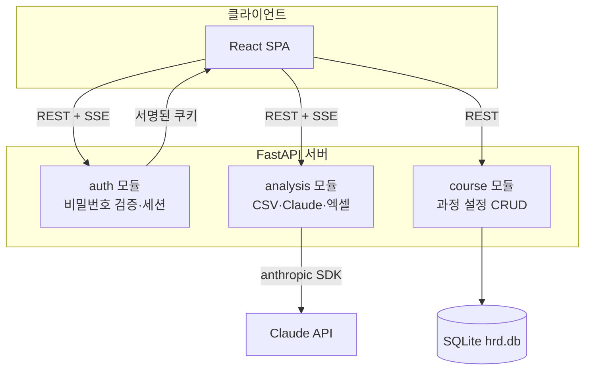
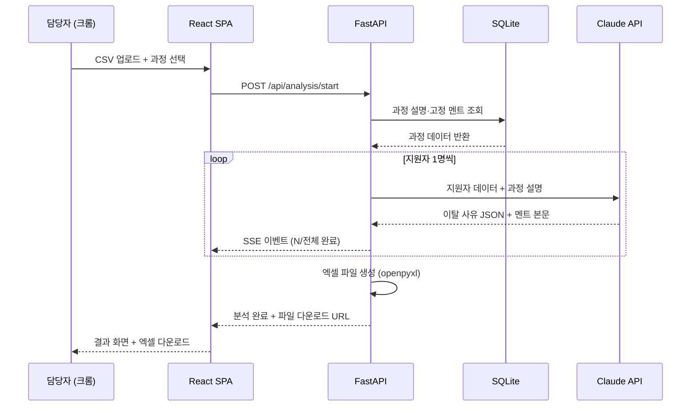
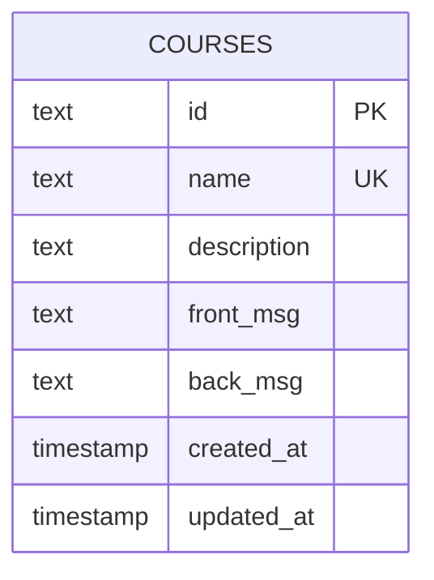

# HRD 전환 어시스턴트 TRD

> 작성일: 2026-06-16 · 버전: v1.0
> PRD: `prd-HRD전환어시스턴트-20260616.md` v1.0
> FRD: `frd-HRD전환어시스턴트-20260616.md` v1.0
> 다음 단계: 브랜드 전략 (`trd-HRD전환어시스턴트-20260616-handoff.md` 참조)

---

## 1. 한 문단 요약

이 도구는 모듈러 모놀로식 구조로, 프론트엔드는 React + Vite + TypeScript, 백엔드는 Python + FastAPI, 데이터베이스는 SQLite를 사용한다. CSV 파싱에 pandas, 엑셀 생성에 openpyxl, Claude AI 호출에 anthropic 공식 SDK를 쓴다. 이 조합을 선택한 가장 큰 이유는 세 가지다. 첫째, CSV·엑셀 처리가 핵심 작업인데 Python 생태계가 압도적으로 성숙하다. 둘째, 사용자 1명·SEO 불필요·외부 공개 없는 내부 도구에 Next.js의 강점이 하나도 필요 없다. 셋째, 서버 1대로 프론트와 백엔드를 동시에 서빙하는 단순한 구조라 개발자 1인이 3~4주 안에 완성할 수 있다.

월 운영비는 사내 PC에서 실행하면 Claude API 비용 200원 미만으로 사실상 무료다. 가장 큰 기술 리스크는 두 가지다. 첫째, SSE(실시간 스트림) 구현 시 FastAPI 비동기 패턴을 반드시 써야 하는데 이를 빠뜨리면 진행 카운트가 작동하지 않는다. 둘째, Claude API 장애 시 분석 자체가 불가능해 수동 처리로 전환해야 한다. 두 리스크 모두 핸드오프에 대응 방법이 명시되어 있다.

---

## 2. 어떤 그림으로 만드는가 (아키텍처)

이 도구는 하나의 서버 프로세스 안에 인증·분석·과정관리 세 가지 역할을 칸막이로 나눈 모듈러 모놀로식 구조다. 서버 1대로 프론트엔드 화면 제공부터 AI 분석까지 전부 처리한다.

### 2.1 아키텍처 결정 — 모듈러 모놀로식

사용자가 1명이고 기능이 단순한 내부 도구에 MSA(서버를 기능별로 여러 대로 나누는 방식)를 도입하면 운영할 서버가 3대 이상으로 늘어나고, 서버 간 통신 오류를 디버깅(오류를 찾아 수정하는 작업)하는 데 출시 기간의 절반을 쓰게 된다. 모듈러 모놀로식은 하나의 서버 안에서 코드만 역할별로 나눠두는 방식이라 운영 부담이 없으면서도, 나중에 특정 모듈만 떼어내 별도 서버로 이전하기 쉬운 구조다.

| 항목 | 모듈러 모놀로식 (선택) | MSA | 서버리스 |
|---|---|---|---|
| 초기 개발 속도 | 빠름 | 느림 | 중간 |
| 운영 서버 수 | 1대 | 3~10대 | 0대 |
| 1인 팀 적합도 | ✅ 매우 적합 | ❌ 부적합 | ⚠️ 중간 |
| 월 운영비 | 무료 (사내 서버) | 50만원+ | 사용량 기반 |

### 2.2 모듈 분해

FRD의 6개 화면을 기능 성격에 따라 3개 모듈로 묶었다. `auth`는 비밀번호 인증과 세션을 담당하고, `analysis`는 CSV 처리·Claude API 호출·엑셀 생성 전체 흐름을 담당하며, `course`는 과정 설정의 저장·조회·수정을 담당한다.



### 2.3 모듈 간 통신

세 모듈은 같은 프로세스 안에 있으므로 함수 호출로 직접 통신한다. 별도 네트워크 요청이나 메시지 큐가 필요 없다. `analysis` 모듈이 과정 설명을 조회할 때 `course` 모듈의 내부 함수를 직접 호출한다.

---

## 3. 어떤 도구로 만드는가 (기술 스택)

프론트엔드·백엔드·DB·인프라·외부 서비스 다섯 영역의 결정을 설명한다. 각 결정마다 대안과 선택 이유를 함께 제시한다.

### 3.1 프론트엔드

React + Vite + TypeScript 조합으로 SPA(Single Page Application — 하나의 HTML 파일 위에서 화면이 전환되는 방식. 페이지 이동 없이 내용만 바뀜)를 만든다. Next.js가 아닌 Vite를 선택한 이유는 SEO와 서버사이드 렌더링이 전혀 필요 없는 내부 도구이기 때문이다. Next.js의 강점을 하나도 활용하지 않으면서 복잡도만 올라가는 것을 피했다. UI 컴포넌트는 shadcn/ui, 스타일링은 Tailwind CSS를 사용해 FRD에 명세된 드롭다운·모달·토스트 같은 요소들을 복사·붙여넣기로 빠르게 완성한다.

| 영역 | 선택 | 대안 | 선택 이유 |
|---|---|---|---|
| 프레임워크 | React + Vite | Next.js, SvelteKit | SEO 불필요 내부 도구, 단순 SPA로 충분 |
| 언어 | TypeScript | JavaScript | AI 코드 생성 정확도 향상, 오류 사전 발견 |
| UI 컴포넌트 | shadcn/ui | MUI, Chakra | 복사 사용, 커스터마이징 자유 |
| 스타일링 | Tailwind CSS | CSS Modules | AI 도구 호환 최고, 빠른 개발 |
| 폼·검증 | React Hook Form + Zod | Formik | TypeScript 친화, 백엔드 스키마 공유 가능 |

> 정밀한 버전 명시와 package.json은 핸드오프 §2 참조.

### 3.2 백엔드

Python + FastAPI로 구성한다. CSV 파싱에 pandas(Python에서 표 형태 데이터를 다루는 표준 라이브러리), 엑셀 생성에 openpyxl(Python에서 .xlsx 파일을 만드는 라이브러리), Claude API 호출에 anthropic 공식 Python SDK를 쓴다. 분석 진행 상황은 SSE(Server-Sent Events — 서버가 완료 이벤트를 클라이언트에 실시간으로 밀어주는 단방향 스트림 방식)로 클라이언트에 전달한다.

Node.js가 아닌 Python을 선택한 가장 큰 이유는 CSV·엑셀 처리 라이브러리의 성숙도 차이다. Node.js의 xlsx 라이브러리로도 구현할 수 있지만, pandas + openpyxl 조합이 코드가 훨씬 짧고 안정적이며 문서도 풍부하다.

| 영역 | 선택 | 대안 | 선택 이유 |
|---|---|---|---|
| 언어·런타임 | Python 3.11+ | Node.js, Go | CSV·엑셀 라이브러리 생태계 압도적 우위 |
| 프레임워크 | FastAPI | Flask, Django | 비동기 지원, 자동 API 문서, 타입 힌트 |
| CSV 파싱 | pandas | csv 모듈 | 컬럼 검증·필터링이 코드 2~3줄로 끝남 |
| 엑셀 생성 | openpyxl | xlsxwriter | 셀 서식·색상 지정 지원 (실패 행 빨간색) |
| AI 호출 | anthropic SDK | HTTP 직접 호출 | 공식 SDK, 에러 처리 내장 |
| 실시간 스트림 | SSE (async generator) | WebSocket, Polling | 단방향 스트림에 가장 단순, 구현 용이 |
| API 방식 | REST | GraphQL, tRPC | Python 백엔드 표준, AI 코드 생성 최적 |

> 정밀한 버전 명시와 requirements.txt는 핸드오프 §3 참조.

### 3.3 데이터베이스

SQLite + SQLAlchemy + Alembic을 사용한다. SQLite는 별도 서버 설치 없이 파일 1개로 작동하는 초경량 DB다. 이 도구가 저장하는 데이터는 과정 설정 테이블 1개, 행 10개 미만이므로 PostgreSQL 같은 본격 DB는 명백히 과도하다. 백업도 `.db` 파일을 복사하면 끝이다.

SQLAlchemy는 Python에서 DB 표를 코드로 다루게 해주는 ORM(Object-Relational Mapping — SQL 쿼리 대신 Python 객체로 데이터를 저장·조회하는 도구)이고, Alembic은 테이블 구조 변경 이력을 관리하는 마이그레이션 도구다. 나중에 PostgreSQL로 전환하더라도 Alembic 덕분에 스키마 이전이 하루 안에 가능하다.

| 영역 | 선택 | 대안 | 선택 이유 |
|---|---|---|---|
| DB | SQLite | PostgreSQL, MySQL | 파일 1개, 서버 설치 불필요, 규모에 완벽 적합 |
| ORM | SQLAlchemy | raw SQL, Tortoise-ORM | Python 표준, FastAPI 궁합 최고 |
| 마이그레이션 | Alembic | 수동 ALTER TABLE | 스키마 변경 이력 관리, PostgreSQL 이전 용이 |
| 캐시 | 없음 | Redis | 단일 사용자 내부 도구, 불필요 |

> 전체 CREATE TABLE 문과 SQLAlchemy 모델 코드는 핸드오프 §4 참조.

### 3.4 인프라

사내 항상 켜진 PC 또는 서버에 설치하고, 더블클릭 배치 파일(Windows: `.bat`, Mac: `.sh`)로 서버를 시작한다. 프론트엔드를 빌드(`npm run build`)하면 생성되는 정적 파일을 FastAPI가 직접 서빙하므로, 서버 프로세스 1개로 프론트와 백엔드가 동시에 작동한다. 클라우드 호스팅이 불필요하므로 인프라 비용이 사실상 없다.

로그는 Python의 RotatingFileHandler(일정 크기 초과 시 자동으로 이전 로그를 삭제하는 로그 도구)로 파일에 저장한다. 10MB 상한, 백업 3개를 보관한다.

| 영역 | 선택 | 대안 | 선택 이유 |
|---|---|---|---|
| 실행 환경 | 사내 PC/서버 | Railway, Fly.io | 개인정보 외부 서버 노출 없음, 비용 없음 |
| 실행 방식 | 더블클릭 배치 파일 | 터미널 명령어, 시스템 서비스 | 비개발자 담당자 친화 |
| CI/CD | 없음 (개발자 직접 배포) | GitHub Actions | 단일 사용자 내부 도구, 과도함 |
| 모니터링 | 로그 파일 | Sentry, Datadog | 단일 사용자, 에러 즉시 인지 가능 |

### 3.5 외부 서비스

이 도구가 의존하는 외부 서비스는 Claude API 하나뿐이다. Anthropic 장애 시 분석 자체가 불가능해지며, 이때는 S-003 에러 화면에 "Claude AI 서비스에 문제가 발생했습니다. Anthropic 상태 페이지를 확인해주세요 (status.anthropic.com)" 안내를 표시한다.

| 용도 | 선택 | 대안 | 월 비용 |
|---|---|---|---|
| AI 분석·멘트 생성 | Claude API (claude-haiku-4-5) | GPT-4o-mini, Gemini Flash | 200원 미만 (하루 5명 기준) |

---

## 4. 데이터가 어떻게 흐르는가

담당자가 CSV를 올리고 엑셀을 받기까지 시스템 안에서 데이터가 어떻게 흘러가는지 보여준다.



### 4.1 데이터 모델 (개요)

이 도구의 DB에는 테이블이 1개뿐이다. 분석 결과는 서버에 저장하지 않고 브라우저 로컬스토리지에만 임시 보관한다.



> 전체 CREATE TABLE 문과 SQLAlchemy 모델 코드는 핸드오프 §4 참조.

---

## 5. 안전을 어떻게 지키는가 (보안)

사내망 내부에서만 접속하는 내부 도구라 외부 공격 위험이 낮다. 그러나 이름·연락처 같은 개인정보를 처리하므로 기본 보안 원칙은 지킨다.

### 5.1 인증·인가

단일 비밀번호로 접속을 제어한다. 비밀번호는 `.env` 파일에 평문으로 저장한다. 5회 연속 실패 시 30초 잠금을 서버 메모리에서 관리한다. 서버 재시작 시 잠금 카운터가 초기화되는 약점이 있으나, 사내망에서만 접속 가능하므로 실제 위협이 낮다. 세션은 `itsdangerous` 라이브러리의 서명된 쿠키(서버가 위변조 여부를 확인하는 암호화 쿠키)로 구현하며 8시간 유지된다.

### 5.2 자격증명 저장

Claude API 키·비밀번호·세션 서명 키는 모두 `.env` 파일에만 저장하고 코드에 직접 쓰지 않는다. `.env` 파일은 `.gitignore`에 반드시 포함해 코드 저장소에 올라가지 않도록 한다. `.env.example` 파일(실제 값 없이 키 이름만 있는 템플릿)을 저장소에 포함해 분실 시 복구 기준을 제공한다.

### 5.3 데이터 보호

사내망 내부 도구이므로 HTTPS를 적용하지 않는다. HTTP로 운영한다. 단, 나중에 클라우드로 이전하면 반드시 HTTPS를 적용해야 한다. 개인정보(이름·연락처 등)는 서버 메모리에서만 처리하고 분석 완료 후 즉시 삭제한다. DB에는 과정 설정만 저장하며 개인정보는 일절 저장하지 않는다.

> 환경변수 목록 전체와 보안 체크리스트는 핸드오프 §5 참조.

---

## 6. 얼마가 드는가 (비용·운영)

사내 PC에서 실행하는 내부 도구라 인프라 비용이 없다. Claude API 비용만 발생한다.

### 6.1 월 운영비 추정

| 단계 | 사용 규모 | 월 비용 | 주요 비용 |
|---|---|---|---|
| 개발·테스트 | 하루 수 회 테스트 | 무료 | Claude API 극소량 |
| v1 운영 | 하루 5명, 주 5일 | **200원 미만** | Claude API만 |
| 확장 (하루 50명) | 10배 증가 | 약 2,000원 | Claude API만 |
| 클라우드 이전 시 | 동일 규모 | $5~10/월 | Railway 또는 Fly.io |

### 6.2 운영 부담 (1인 가정)

담당자는 매일 더블클릭으로 서버를 시작하고 종일 켜두면 된다. 개발자는 코드 수정 시 배포용 배치 파일을 실행해 빌드와 서버 재시작을 한 번에 처리한다. 로그 파일이 10MB를 초과하면 자동으로 이전 로그가 삭제되므로 별도 관리가 필요 없다.

### 6.3 3~4주 출시 가능 여부

✅ **가능.** 화면 6개, DB 테이블 1개, 외부 API 1개의 단순한 구조다. 개발자 1인 기준 백엔드 1.5주 + 프론트엔드 1.5주 + 통합 테스트 0.5주 = 3.5주 안에 출시 가능하다.

---

## 7. 무엇이 위험한가 (리스크·마이그레이션)

### 7.1 가장 큰 기술 리스크

- **SSE async 패턴 미준수**: FastAPI에서 SSE를 구현할 때 동기(sync) 함수로 작성하면 스트림이 막혀 진행 카운트가 작동하지 않는다. 반드시 `async generator` 패턴으로 구현해야 한다. 핸드오프 §7에 코드 예시를 포함했다.

- **Claude API 단일 의존성**: Anthropic 서비스 장애 시 분석 자체가 불가능하다. 에러 화면에 상태 페이지 링크를 안내하고 담당자가 수동으로 처리하는 것 외에 v1에서 할 수 있는 대응이 없다. v2에서 Gemini Flash를 폴백(Fallback — 기본 서비스가 실패할 때 대체 서비스로 자동 전환하는 방식)으로 추가할 수 있다.

- **SQLite 동시 쓰기 제한**: SQLite는 동시 쓰기가 제한적이다. 사용자가 1명이므로 문제가 없지만, 사용자가 여러 명으로 늘어나면 PostgreSQL로 이전이 필요하다.

### 7.2 벤더 락인과 마이그레이션 경로

이 도구의 외부 의존성은 Claude API 1개뿐이라 벤더 락인 위험이 낮다.

| 서비스 | 의존도 | 전환 난이도 | 전환 시 작업량 |
|---|---|---|---|
| Claude API | 핵심 (분석·멘트) | 낮음 | 프롬프트·응답 파싱 코드만 수정 (~1일) |
| SQLite | DB | 낮음 | Alembic으로 PostgreSQL 이전 (~1일) |
| 사내 PC/서버 | 실행 환경 | 낮음 | Railway·Fly.io 배포 설정 (~2일) |

---

## 부록 A. 적대적 검토 결과

```
━━━ 🔍 적대적 검토 ━━━
검토 관점: PM + Dev + DevOps 3자 교차
검토 대상: HRD 전환 어시스턴트 TRD v1.0

🔴 HIGH-1: SSE async 패턴 주의 — 핸드오프 반영됨
   수정: 핸드오프 §7에 async generator 코드 예시 포함

🔴 HIGH-2: 5회 잠금 카운터 서버 재시작 시 초기화
   수정: 사내망 내부 도구 특성상 v1 허용.
         핸드오프 §리스크에 명시, v2에서 SQLite 저장으로 개선.

🟡 MEDIUM-1: 배치 파일 가상환경 활성화 누락 가능
   수정: 핸드오프 §6 배치 파일 전문에 venv 활성화 포함

🟡 MEDIUM-2: SQLite 파일 경로 미정
   수정: .env에 DB_PATH 추가, ~/hrd-data/hrd.db 기본값 적용

🟡 MEDIUM-3: 프론트 빌드 자동화 미정
   수정: 개발용·배포용 배치 파일 분리, 핸드오프 §6 전문 포함

🟢 LOW-1: .env 분실 시 복구 방법 미정
   수정: .env.example 포함, 핸드오프 §5 복구 절차 명시

🟢 LOW-2: 로그 파일 용량 관리 미정
   수정: RotatingFileHandler 10MB 상한·백업 3개 적용

━━━ 요약 ━━━
🔴 HIGH: 0건 (모두 해결) / 🟡 MEDIUM: 0건 / 🟢 LOW: 0건
진행 판정: 전체 해결 — 브랜드 전략 진행 가능
━━━━━━━━━━━━━━━━━
```
